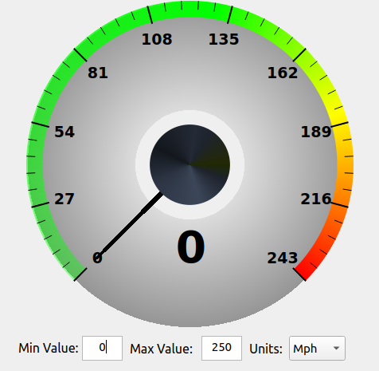
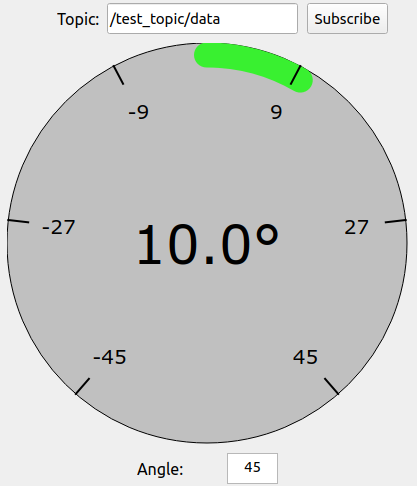

# RQT gauges

`rqt_gauges` is and `rqt` Python plugin. It allows to create the different types of gauges:

 - Speedometer
 - Steering wheel position
 - Brake and throttle

**Note**: This package is still not released in any ros distribution.

These widget are expected to be able to subscribe to a specific topic and select a field from that topic to show on the gauge UI.
The following features are added to this widget:

 - Show the value of the specified topic field
 - Modify the minimum and maximum value of the gauge
 - Modify the units of the speedometer


## How to compile it

```bash
cd <workspace-with-the-package>
colcon build --packages-select rqt_gauges
source install/setup.bash
```

## RQT

Run the RQT plugin UI:

```bash
rqt
```

Go to the following path on the menu tab: Plugins -> Visualization ->

<center>
    
</center>

### Speedometer

<center>
    
</center>

### Steering wheel

<center>
    
</center>

### Brake and throttle

<center>
    
</center>

## Standalone Plugin

Run the standalone node:

```bash
ros2 run rqt_gauges rqt_gauges
```

## How to use it

Play by changing the minimum limit, maximum limit and units of the gauge with the boxes at the bottom of the widget. Subscribe to topics and watch the gauge move.

Create two different publishers: one with a `geometry_msgs/msg/Twist` and another one with `std_msgs/msg/Int16`:

In one terminal:

```bash
ros2 topic pub /test_topic_2 geometry_msgs/msg/Twist "linear:
  x: 70.0
  y: 0.0
  z: 0.0
angular:
  x: 0.0
  y: 0.0
  z: 0.0"
```

In another terminal:

```bash
ros2 topic pub /test_topic std_msgs/msg/Int16 "data: 10"
```

Go to the plugin and start filling the text box on top of it until you reach the specific field you want for a specific topic (there is a topic autocompleter in order to avoid any name issues):

Select the topic and completing the required field:

 - `/test_topic/data`
 - `/test_topic_2/linear/x`


Hit the `Subscribe` button to the right.
